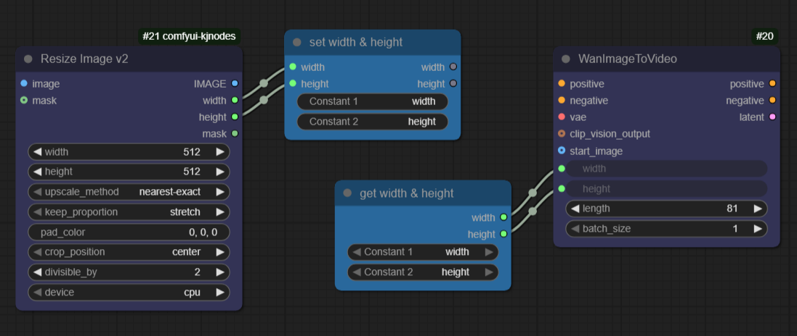

# Ovum

Some custom nodes for Comfy that I just couldn't live without.  Some have come
from other packages that were annoyingly hard to find, some have been improved
from other peoples' work who don't accept PR requests, some have been made
by me, and one has been made entirely by AI (but basically had to be rewritten
afterwards).

## Twin Connectors: SetTwinNodes and GetTwinNodes

A pair of graph-cleaning utility nodes designed to “tunnel” connections and reduce visual clutter without sacrificing clarity or type-safety.

Effortless to type one-handed: enter SETTW or GETTW to locate these nodes fast—so your right hand can stay on the mouse (because where else would your right hand be?)

All the functionality of Kijai's Set/Get nodes, easier to use than easyUse SetNodes, twice as many connections, and unbelievably more automated.

- SetTwinNodes accepts an arbitrary number (two... more coming soon) of inputs and exposes matching outputs, letting you collect and forward values by meaningful constant names rather than raw wires.
- GetTwinNodes presents matching outputs, selected via lightweight “constant” widgets. You pick the names you care about; the node provides outputs of the corresponding types.

What makes them useful:
- They work in subgraphs!
- ~Clean labels over raw types: when a link is attached, constants and slots can inherit human-friendly labels from the connected endpoints; titles are built from the chosen constants.~
- ~Provisional naming: when a Get node learns a name from a downstream connection that does not yet exist on any Set, it marks the constant with an asterisk to signal “choose a valid source later.” When the matching Set appears, the names reconcile automatically.~
- Works in either order: you can drop a Get first and wire it to a consumer; later, when a Set of the right type appears, the system can adopt the better name and update labels across the link.
- Sensible colorization: nodes can colorize based on the first two connected, typed slots to give fast visual feedback while keeping the graph readable.
- Serialization-safe: saved widget values and output types are respected on load; no surprise re-labelling. (Mostly)
- ~Ergonomic pairing: when you pick one constant and the system recognizes an associated partner, it can suggest or create the companion slot automatically; if it can’t, it still creates a second empty selector so you can complete the pair manually.~
- Tunneling without surprises: instant graphic feedback warns of setters with no getters.

How to use:
1. Drop a SetTwinNodes near your sources and connect any values you want to “publish.” Give each constant a clear name (e.g., width, height, start_image). The node mirrors types to its outputs and propagates names to matching Gets.
2. Drop a GetTwinNodes near your consumers and pick the same constant names to “subscribe.” If you connect the Get to a consumer before a matching Set exists, it will note your intent and reconcile once a suitable Set appears.
3. Rename safely: titles and labels follow your constants (sometimes); if a label equals its raw type (a “lame name”), later Set connections can adopt a better name from a compatible Get to keep the graph readable.
4. Toggle “Show connections” from the node menu to visualize virtual links between Sets and Gets without adding extra wires.

These nodes are meant to keep large graphs navigable while preserving intent through names, not just types. They are deliberately forgiving when you work top-down or bottom-up, and they do their best to stay out of your way once you’ve chosen the labels that make sense in your workflow.

## Python String Format

Turn multiple inputs into a single, neatly formatted string using Python’s `str.format` syntax. This node is ideal for building prompts, captions, file names, or any text that needs values injected at runtime.

What it does:
- Accepts a format template (fmt) and inserts values into placeholders like `{arg0}`, `{arg1}`, etc.
- Produces a single STRING output.
- Uses Python’s standard formatting rules, so you get powerful control over numbers, padding, alignment, and more.

Placeholders:
- Use `{arg0}` for the first input, `{arg1}` for the second, and so on.
- You can apply format specs: `{arg0:.2f}`, `{arg1:03d}`, `{arg2:^20}`, `{arg3!r}`.
- To show a literal curly brace, escape it: `{{` or `}}`.

New lines:
- Press Enter in the fmt field to insert real line breaks; the output will contain those line breaks exactly.
- You can also embed newline escapes: use `\n` for a single new line, or `\n\n` to insert a blank line.
- Mix placeholders and text across lines to build readable multi-line prompts or file names.

Examples:
- Multiline prompt with escape sequences:
  - fmt: `Positive: {arg0}\nNegative: {arg1}\nSteps: {arg2}`
  - Inputs: arg0 = "cozy cabin", arg1 = "low quality, blurry", arg2 = 30
  - Output:
        Positive: cozy cabin
        Negative: low quality, blurry
        Steps: 30
- Multiline using literal line breaks:
  - fmt:
        Title: {arg0}

        {arg1}
        Tags: {arg2}, {arg3}
  - Inputs: arg0 = "Autumn Forest", arg1 = "golden hour, volumetric light", arg2 = "forest", arg3 = "sunset"
  - Output:
        Title: Autumn Forest

        golden hour, volumetric light
        Tags: forest, sunset

Common recipes:
- Basic substitution:
  - fmt: `Prompt: {arg0}. Steps: {arg1}`
  - Inputs: arg0 = "A cozy cabin at night", arg1 = 30
  - Output: `Prompt: A cozy cabin at night. Steps: 30`
- Float precision:
  - fmt: `Score: {arg0:.2f}`
  - Inputs: arg0 = 0.98765
  - Output: `Score: 0.99`
- Zero-padded integers:
  - fmt: `Image_{arg0:04d}`
  - Inputs: arg0 = 7
  - Output: `Image_0007`
- Alignment and width:
  - fmt: `[{arg0:^10}]`
  - Inputs: arg0 = "OK"
  - Output: `[    OK    ]`
- Literal braces:
  - fmt: `Config: {{enabled: {arg0}}}`
  - Inputs: arg0 = true
  - Output: `Config: {enabled: true}`

Tips:
- Missing or empty inputs are gracefully replaced with the literal string "None" at format time, so your workflow keeps running even if something disconnects or a generator yields no value. This is a dramatic improvement over other formatting nodes that can kill your workflow right when it’s about to finish saving that super‑long video.
- Another bonus: non‑scalar inputs (lists, dictionaries, tuples, and custom objects) are kept as real Python objects rather than being flattened to JSON. That means you can index or key into them right in the format string.
- Robust error handling: if formatting fails (e.g., invalid format spec, out-of-range index, missing key/attribute), the node prints the error to the console and returns the error text as the output string instead of crashing your run.
- Numbers respect format specs; use them to avoid manual rounding or string tricks.
- If you need default values, provide them upstream (e.g., via a constant/text node) and wire them in.

Structured data (lists, dicts, tuples):
- Lists:
  - fmt: `Top tags: {arg0[0]}, {arg0[1]}, count={arg0[2]:02d}`
  - Inputs: arg0 = ["hdr", "sunset", 7]
  - Output: `Top tags: hdr, sunset, count=07`
- Dictionaries:
  - fmt: `User: {arg0[name]} (id={arg0[id]})`
  - Inputs: arg0 = {"name": "Riley", "id": 42}
  - Output: `User: Riley (id=42)`
- Tuples (or list-like sizes):
  - fmt: `Size: {arg0[0]}x{arg0[1]}`
  - Inputs: arg0 = (1024, 576)
  - Output: `Size: 1024x576`
- You can combine indexing with format specs:
  - fmt: `Mean: {arg0[1]:.2f}`
  - Inputs: arg0 = ["loss", 0.123456]
  - Output: `Mean: 0.12`

Use cases:
- Build dynamic prompts from multiple upstream nodes.
- Compose file names with counters, dates, or padded indices.
- Generate human-readable summaries that include numeric metrics.

## Timer

How long does the workflow spend in each node?

Somewhat rough around the edges with a number of confusing buttons and inputs (thankfully you can ignore them all), but a useful tool for timing and debugging.

## Live Crop (interactive)

Visually crop, expand, and rotate an image with interactive guides rendered directly in the node.

- Inputs:
  - crop_top, crop_bottom, crop_left, crop_right (FLOAT [-1..1]):
    - Negative: crops that fraction of the original dimension from that side (e.g., -0.1 removes 10% from that edge).
  - image (IMAGE, optional), mask (MASK, optional): both are processed with the same operations; masks use white=255 for padding.
- Outputs: IMAGE, MASK
- UI: The node shows a preview of the incoming image(s) with red lines indicating where the crop will occur. Adjust the sliders or drag the guides (think: Photoshop rulers) to update.

Notes:
- When no image is connected, the node returns None; when connected, the preview is downscaled for responsiveness.
- Multiple images/batches supported, allowing you crop as you go: adjust the cropping for the second image, which will be the first image by the time the next workflow executes.

## Environment Bridge: Set Environment Variable and Get Environment Variable

### Browser Local Storage: Set LocalStorage and Get LocalStorage

Persist small strings in the browser between sessions without touching the server environment.

- Set LocalStorage: Writes a key/value into the browser's localStorage (strings only). Includes an optional passthrough to help enforce execution order. If overwrite=false and the key exists in localStorage, the value is left unchanged.
- Get LocalStorage: Reads a key from the browser's localStorage with a default fallback. Returns (value, exists).

Notes:
- Backend nodes cannot directly access the browser; the Set node triggers a frontend action to store the value using ComfyUI's UI-return channel. The Get node returns the provided default at execution time but is useful for coordinating UI state; use environment variables if you need true backend-readable values.
- Keys and values are stored as strings. If you need structures, encode/decode to JSON in the graph.

Publish and subscribe values anywhere in your workflow (and even across workflows) using the process environment as a lightweight, global message bus.

What they do:
- “Set Environment Variable” writes key/value pairs to the process environment. You can optionally thread a passthrough input/output to enforce execution order without altering data flow.
- “Get Environment Variable” reads a key from the environment with a fallback default. It is change-aware and will re-evaluate when the targeted variable changes.
- Together they enable out‑of‑band data routing without extra wires, allowing one‑to‑many fan‑out, late binding, and cross‑graph coordination.

Why it’s special:
- Global scope within the process: values are visible to all workflows running in the same Comfy session.
- “Virtual wires” without clutter: connect distant parts of a large graph through names, not cables.
- Change detection: readers can refresh only when a variable’s value or existence actually changes, keeping runs fast and deterministic.
- Execution ordering: use the passthrough to place setting/getting in precise positions of your pipeline without affecting the payload being processed.

Patterns you can build:
- Publish/Subscribe hub:
  - Upstream nodes “publish” dimensions, models, seeds, or file paths with “Set Environment Variable.”
  - Downstream consumers “subscribe” with “Get Environment Variable” wherever they need the same value.
- Cross‑workflow handoff (inter‑workflow):
  - Use a stable variable name (e.g., PROJECT_PREFIX, ACTIVE_CHECKPOINT) so separate workflows launched in the same session share configuration.
- Pseudo‑feedback loops (intra‑workflow):
  - Emulate feedback by writing a value early and reading it later in the same run to condition subsequent steps, without creating illegal graph cycles.
- State and toggles:
  - Flip feature flags (e.g., USE_HIRES_FIX=true) to drive conditional branches or tool selection across multiple, otherwise unconnected nodes.
- Secrets and tokens:
  - Inject API keys, model licenses, or service endpoints at runtime; consumers read them on demand.
- One‑to‑many routing:
  - Publish once, consume everywhere—useful for common output directories, date stamps, or version tags.

Common recipes:
- Share a counter between runs:
  - Read COUNT with “Get Environment Variable” (default 0) → increment in your logic → write back with “Set Environment Variable” for the next run.
- Centralize paths:
  - Use “Set Environment Variable” with name=OUTPUT_DIR, value=/data/renders → multiple savers read OUTPUT_DIR to stay in sync.
- Switch models/tools globally:
  - Use “Set Environment Variable” with name=ACTIVE_MODEL, value=SDXL → routers or conditionals pick the right branch downstream.

Tips and caveats:
- Scope: values live only for the current process and its children; they do not persist after a restart.
- Collisions: environment space is shared; pick distinctive names or prefixes (e.g., OVUM_) to avoid clashes.
- Security: avoid printing secrets; prefer generic names and keep sensitive values out of saved screenshots or public logs.
- Consistency: environment variables are strings; encode complex data (e.g., JSON) explicitly if needed and decode where you read it.
- Ordering: use the passthrough to ensure “set before get” along your execution path; visual proximity doesn’t influence execution—connections do.

In short, “Set Environment Variable” and “Get Environment Variable” act like SetNode/GetNode with super powers: they can tunnel values across the graph, coordinate multiple consumers, and enable inter‑ and intra‑workflow value transfer—while staying simple, explicit, and robust.

## Halt Toggle Node

The **Halt Toggle** node is a versatile control node designed to bring simplified workflow execution halts to your projects.

### Key Features:
- **Flexible Halting:** Easily pause workflow execution when the `stop_now` condition is met.
- **Auto-Reset Capability:** The node can automatically reset itself after halting, allowing seamless continuation of the workflow in subsequent runs without manual intervention.
- **Delay Support:** Introduce a configurable delay (in milliseconds) before halting the workflow.
- **Passthrough Convenience:** The node forwards inputs, keeping graph wiring intuitive and maintaining data flow consistency when used as part of a larger workflow.
- **Detailed Feedback:** Provides outputs to indicate whether a stop was applied and if an auto-reset was triggered.

### How It Works:
When the `stop_now` input is set to true, the **Halt Toggle** node halts the workflow execution. However, if the **reset_after_stop** option is enabled, the halt will auto-disable for the next run, ensuring the workflow proceeds smoothly without requiring manual toggle adjustments.

### Use Case Example:
If you have a workflow that requires pausing at specific stages or debugging steps, the Halt Toggle node provides an elegant solution to stop execution conditionally and resume it dynamically in subsequent runs.

Enhance your workflow control with the Halt Toggle node, empowering you to build more robust and interactive systems effortlessly.

## Pystructure Data Nodes (complementary to ComfyUI-LogicUtils)

These nodes are complementary to the excellent collection at https://github.com/aria1th/ComfyUI-LogicUtils. They focus on list manipulation and small data utilities that pair well with logic/structure nodes from that set.

- List Slice
  - What it does: Returns a slice of an input list using JavaScript-like slice semantics.
  - Inputs:
    - py_list (LIST): The source list.
    - start (INT): Start index. Negative values count from the end. Clamped to bounds; default 0 if empty.
    - end (INT): End index (non-inclusive). Negative values count from the end. Clamped to bounds; defaults to list length if empty.
  - Output:
    - LIST: A new list containing the requested slice. If start >= end after normalization, returns an empty list.
  - Notes: Behavior mirrors JS slice for negative indices and boundary clamping; does not mutate the input list.

- List Splice
  - What it does: Splices into a list using JavaScript-like splice semantics: remove delete_count items starting at start and insert items from insert_list.
  - Inputs:
    - py_list (LIST): The target list (will be modified in place).
    - start (INT): Start index. Negative values count from the end. Clamped to valid positions.
    - delete_count (INT): Number of items to remove (clamped to remaining length; negatives treated as 0).
    - insert_list (LIST): Items to insert at the splice position (can be empty to perform pure deletion).
  - Outputs:
    - LIST (modified_list): The same list instance after splicing.
    - LIST (removed_elements): A list of the elements that were removed.
  - Notes: Mirrors JS semantics for start and delete_count; performs in-place mutation of py_list.

- Repeat Item
  - What it does: Produces a list containing the given item repeated count times.
  - Inputs:
    - item (any): Any value to repeat.
    - count (INT): Number of repetitions. Minimum 0; negatives are treated as 0.
  - Output:
    - LIST: [item, item, ..., item] repeated count times.
  - Notes: Non-mutating; useful for building lists of constants, seeds, file paths, or objects for batch operations.

- Reverse List
  - What it does: Returns a new list in reverse order.
  - Inputs:
    - py_list (LIST): The source list.
  - Output:
    - LIST: A new list with elements reversed.
  - Notes: Non-mutating; the input list is not modified.

- List Concat
  - What it does: Concatenates two lists similar to JS Array.concat.
  - Inputs:
    - list_a (LIST): First list.
    - list_b (LIST): Second list (optional; blank treated as empty).
  - Output:
    - LIST: New list of elements of list_a followed by elements of list_b.
  - Notes: Non-mutating.

- List IndexOf
  - What it does: Finds the first index of a value in a list like JS indexOf.
  - Inputs:
    - py_list (LIST): The list to search.
    - search_element (any): Value to find.
    - start (INT): Optional fromIndex; negative values count from end; blank -> 0.
  - Output:
    - INT: Index of the match; -1 if not found.

- List Join
  - What it does: Joins elements into a string like JS join.
  - Inputs:
    - py_list (LIST): Elements to join.
    - separator (STRING): Optional separator; blank/unspecified -> comma, empty string -> no separator.
  - Output:
    - STRING: Joined string.

- XRange
  - What it does: Python-like xrange/range iterator without generators. Outputs current value, full list, and a boolean flag for exhausted/looped.
  - Inputs:
    - stop (INT): End (exclusive). Required.
    - start (INT): Optional start; blank -> 0.
    - step (INT): Optional step; blank -> 1; cannot be 0; can be negative.
    - repeat (BOOLEAN): If true, wraps to the start (or end for negative step) when reaching the end; the flag output is true on the wrap iteration.
    - cursor (INT): Current index into the range; you can set/reset this manually to control which value is output.
    - advance (BOOLEAN): If true (default), increases cursor by 1 each evaluation so you can tick through values using Repeat/Trigger.
  - Outputs:
    - INT: current value at the cursor.
    - LIST: the full expanded list of values (range(start, stop, step)).
    - BOOLEAN: exhausted_or_looped — true when the range is exhausted (with repeat disabled) or when it loops (with repeat enabled).
  - Notes:
    - Negative steps are supported exactly like Python range. If the computed range is empty, the list is empty and the flag is true; current value returns 0.

## Open Output via Shell (secure)

## Text Ovary (overlay text on images)

Text Ovary is a polished, in-house merge of the excellent TextOverlay node (sfinktah/comfyui-textoverlay) adapted for Ovum.

Why you’ll like it:
- Super simple: plug in an IMAGE and a STRING, pick a font, done.
- Looks great: fill + stroke with independent opacity to keep captions readable over any background.
- Precise placement: left/center/right, top/middle/bottom, with padding and x/y nudges.
- Multiline aware: sensible line spacing and alignment across lines.
- Batch-friendly: renders the same text across a whole batch efficiently.

Inputs:
- image (IMAGE)
- text (STRING, multiline)
- font_size (INT)
- font (choice from bundled fonts)
- fill_color_hex (STRING, e.g. #ffffff)
- stroke_color_hex (STRING)
- stroke_thickness (FLOAT, relative to font size)
- padding (INT)
- horizontal_alignment (left|center|right)
- vertical_alignment (top|middle|bottom)
- x_shift, y_shift (INT)
- line_spacing (FLOAT)
- stroke_opacity (FLOAT)

Output:
- IMAGE with the text composited

Tip: Pair with Python String Format to build captions dynamically from metadata or prompts.

Safely open your rendered media with the system’s default app—no fragile shell strings, no workflow‑stopping errors.

Why you’ll like it:
- Validates the path exists and is a regular file before trying to open it.
- Accepts only image/video types (via MIME detection) to avoid launching arbitrary files.
- Uses platform‑appropriate launchers:
  - Windows: start " <file> (handles spaces and the window‑title quirk).
  - macOS: open <file>
  - Linux: xdg-open <file>
- Secure by design: runs without a shell so spaces/quotes can’t break or inject commands.
- Non‑fatal: any failure returns an “[ERROR] …” string; your workflow keeps going.

Inputs:
- input (any, optional passthrough): helps enforce execution order; doesn’t alter your data.
- filename (STRING): full path to the image or video you want to open.

Output:
- STRING: a success message or an “[ERROR] …” detail you can log, display, or ignore.

Tips:
- Wire filename from your saver node to auto‑open the latest result.
- Works well with format/concat nodes to build paths dynamically.
- On headless systems, the open command may be unavailable; you’ll get a clear error message instead of a crash.

